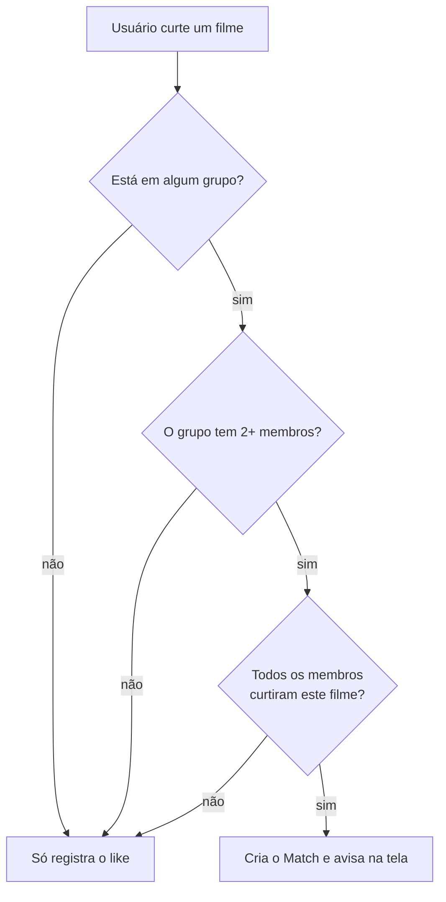

# MovieMatch

> "Tinder para filmes em grupo": cada pessoa dá like ou dislike nos filmes, e quando
> **todo mundo do grupo** curte o mesmo filme, é match — a discussão de "o que a gente
> vai ver hoje?" acaba ali.


---

## Índice

- [Sobre](#sobre)
- [Como funciona](#como-funciona)
- [Stack](#stack)
- [Começando](#começando)
- [Com Docker (recomendado)](#com-docker-recomendado)
- [Sem Docker](#sem-docker)
- [Scripts](#scripts)
- [Decisões de arquitetura](#decisões-de-arquitetura)

---

## Sobre

MovieMatch resolve a paralisia de escolha de um grupo de amigos. Em vez de discutir no
chat, cada pessoa passa pelos filmes populares da [TMDB](https://www.themoviedb.org/)
dando like ou dislike no seu próprio ritmo. O backend cruza os votos dentro de cada
grupo e registra o match assim que todos os membros curtiram o mesmo título.

**Funcionalidades**

- Cadastro e login com usuário e senha (sessão de 7 dias)
- Feed de filmes da TMDB, em português, sem repetir o que você já votou
- Toque no card para ver a **descrição completa**, ano e nota
- Grupos com código de convite para compartilhar
- Match automático no momento do scroll, com aviso na tela
- Menu do usuário com contadores e a lista de filmes curtidos (carregada de 20 em 20)

## Como funciona

O scroll é **global por usuário** — você vota em um filme uma única vez, mesmo estando
em vários grupos. O match é calculado por grupo, no momento do like:



Um match, uma vez criado, **nunca é revogado**: ele registra um acordo que aconteceu
naquele momento. Entrar ou sair do grupo depois não invalida os matches anteriores.

## Stack

| Camada    | Tecnologias                                                        |
| --------- | ------------------------------------------------------------------ |
| Backend   | Node.js 20, TypeScript, Fastify 4, Prisma 5, Zod, PostgreSQL 16     |
| Frontend  | React 18, TypeScript, Vite 5, Tailwind CSS 3                        |
| Infra     | Docker Compose (Postgres + API + nginx), healthchecks, hot reload   |
| Externo   | [TMDB API](https://developer.themoviedb.org/docs) (catálogo de filmes) |

Sem bibliotecas de autenticação: as senhas usam `scrypt` e os tokens são HMAC, ambos do
`node:crypto` — nada de dependência nativa para complicar a imagem Docker.

## Começando

**Pré-requisitos**

- Uma chave da TMDB (gratuita): https://www.themoviedb.org/settings/api
- Docker Desktop **ou** Node.js 20+ e PostgreSQL 16 locais

### Com Docker (recomendado)

Sobe Postgres + backend + frontend de uma vez, já com o schema aplicado e as contas de
demonstração criadas.

```bash
cp .env.example .env     # preencha TMDB_API_KEY e AUTH_SECRET
docker compose up --build
```

| Serviço  | URL                                          |
| -------- | -------------------------------------------- |
| Frontend | http://localhost:8080                        |
| Backend  | http://localhost:3333 (health em `/health`)  |
| Postgres | `localhost:5432`                             |

**Modo desenvolvimento (hot reload)** — `tsx watch` no backend e Vite dev server no
frontend, com o código do host montado nos containers:

```bash
docker compose -f docker-compose.dev.yml up --build
```

O frontend passa a responder em http://localhost:5173. É um arquivo completo, não um
override: rode **um ou outro**, nunca os dois juntos (disputam nomes de container e
portas). Se mexer em algum `package.json`, recrie os volumes anônimos com `-V`.

Comandos úteis:

```bash
docker compose logs -f backend                   # acompanhar logs
docker compose exec backend npx prisma studio    # inspecionar o banco
docker compose down                              # parar tudo
docker compose down -v                           # parar e APAGAR o volume do Postgres
```

### Sem Docker

São **dois servidores**, em terminais separados. O de `:5173` é o que se abre no
navegador; `:3333` responde só JSON.

**1. Backend**

```bash
cd backend
npm install
cp .env.example .env     # preencha DATABASE_URL, TMDB_API_KEY e AUTH_SECRET
npx prisma db push       # aplica o schema (o projeto ainda não versiona migrations)
npm run seed             # cria as contas de demonstração
npm run dev              # http://localhost:3333
```

**2. Frontend**

```bash
cd frontend
npm install
cp .env.example .env     # já aponta para o backend local
npm run dev              # http://localhost:5173
```

## Scripts

**backend**

| Comando                  | O que faz                                          |
| ------------------------ | -------------------------------------------------- |
| `npm run dev`            | API com recarga automática (`tsx watch`)           |
| `npm run build`          | Compila TypeScript para `dist/`                    |

**frontend**

| Comando           | O que faz                                  |
| ----------------- | ------------------------------------------ |
| `npm run dev`     | Vite dev server em `:5173`                 |
| `npm run build`   | Checagem de tipos + build de produção      |


## Decisões de arquitetura

- **scroll global por usuário, match por grupo.** Você curte um filme uma vez só; o
  cálculo do match compara os likes dos membros dentro de cada grupo. Evita re-swipar
  os mesmos filmes em grupos diferentes.
- **Match exige 2+ membros.** Num grupo de uma pessoa, todo like viraria match sozinho.
- **Match é registro histórico e fica congelado.** Uma vez criado, nunca é revogado —
  mudanças na composição do grupo não disparam revalidação. É intencional.
- **Autenticação sem biblioteca.** `scrypt` para senhas, HMAC do `node:crypto` para os
  tokens (7 dias). O erro de login é genérico de propósito (`"Usuário ou senha
  inválidos"`) para não revelar quem tem conta; o de cadastro é específico, porque a
  pessoa precisa saber o que corrigir.
- **Frontend sem router.** A navegação é estado local em `App.tsx`
  (`tab === 'scroll' | 'groups'`) e a sessão vive no `localStorage`. Diálogos são
  sobreposições (`fixed inset-0`), não telas: fecham no clique no fundo, no ✕ e no `Esc`.
- **Curtidos paginados.** `/me/profile` devolve só os contadores e `/me/liked` entrega
  20 por vez, porque resolver título e pôster custa uma chamada à TMDB por filme. A
  grade busca a página seguinte sozinha com `IntersectionObserver`. O cursor ordena por
  `[createdAt desc, id desc]` — o `id` é desempate obrigatório, já que likes gravados no
  mesmo instante não têm ordem total.
- **Feed com página inicial sorteada.** Começar sempre na página 1 da TMDB fazia todo
  mundo ver os mesmos 20 filmes; o backend sorteia onde entrar no catálogo e vai
  buscando páginas até juntar filmes novos o bastante.

