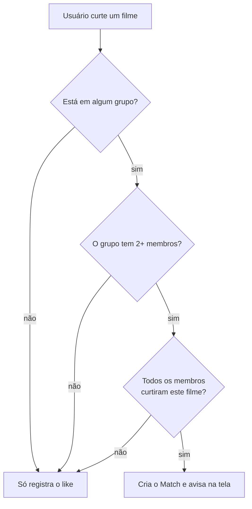

# MovieMatch

> "Tinder para filmes em grupo": cada pessoa dá like ou dislike nos filmes, e quando
> **todo mundo do grupo** curte o mesmo filme, é match — a discussão de "o que a gente
> vai ver hoje?" acaba ali.


---

## Índice

- [Sobre](#sobre)
- [Como funciona](#como-funciona)
- [Stack](#stack)
- [Começando](#começando)
- [Com Docker (recomendado)](#com-docker-recomendado)
- [Sem Docker](#sem-docker)
- [Scripts](#scripts)
- [Deploy na Vercel](#deploy-na-vercel)
- [Filme adulto não entra no feed](#filme-adulto-não-entra-no-feed)
- [O que volta ao feed](#o-que-volta-ao-feed)
- [Match em tempo real](#match-em-tempo-real)
- [Duas contas no mesmo navegador](#duas-contas-no-mesmo-navegador)
- [Ranking da semana](#ranking-da-semana)
- [Idioma](#idioma)
- [Chat de dúvidas](#chat-de-dúvidas)
- [Decisões de arquitetura](#decisões-de-arquitetura)

---

## Sobre

MovieMatch resolve a paralisia de escolha de um grupo de amigos. Em vez de discutir no
chat, cada pessoa passa pelos filmes populares da [TMDB](https://www.themoviedb.org/)
dando like ou dislike no seu próprio ritmo. O backend cruza os votos dentro de cada
grupo e registra o match assim que todos os membros curtiram o mesmo título.

**Funcionalidades**

- Cadastro e login com usuário e senha (sessão de 7 dias)
- Feed de filmes da TMDB, no idioma do navegador, sem repetir o que você já curtiu
- **Sem filme adulto**: só entram os classificados até 16 anos pela DJCTQ
- Toque no card para ver a **descrição completa**, ano e nota
- Grupos com código de convite para compartilhar
- Match automático no momento do scroll, com aviso na tela **para todos do grupo**,
  sem precisar recarregar
- Menu do usuário com contadores e a lista de filmes curtidos (carregada de 20 em 20)
- **Ranking global** dos filmes mais curtidos nos últimos 7 dias
- **Interface em português ou inglês**, escolhida pelo idioma do navegador
- Chat de dúvidas sobre o app, no canto inferior esquerdo, respondido por um assistente
  (Gemini 3.5 Flash). Opcional: sem `GEMINI_API_KEY` o resto do app funciona igual

## Como funciona

O scroll é **global por usuário** — seu voto vale para todos os seus grupos ao mesmo
tempo, não é por grupo. O match é calculado por grupo, no momento do like:



Um match, uma vez criado, **nunca é revogado**: ele registra um acordo que aconteceu
naquele momento. Entrar ou sair do grupo depois não invalida os matches anteriores.

## Stack

| Camada    | Tecnologias                                                        |
| --------- | ------------------------------------------------------------------ |
| Backend   | Node.js 20, TypeScript, Fastify 4, Prisma 5, Zod, PostgreSQL 16     |
| Frontend  | React 18, TypeScript, Vite 5, Tailwind CSS 3                        |
| Infra     | Docker Compose (Postgres + API + nginx), healthchecks, hot reload   |
| Externo   | [TMDB API](https://developer.themoviedb.org/docs) (catálogo de filmes) |

Sem bibliotecas de autenticação: as senhas usam `scrypt` e os tokens são HMAC, ambos do
`node:crypto` — nada de dependência nativa para complicar a imagem Docker.

## Começando

**Pré-requisitos**

- Uma chave da TMDB (gratuita): https://www.themoviedb.org/settings/api
- Docker Desktop **ou** Node.js 20+ e PostgreSQL 16 locais

### Com Docker (recomendado)

Sobe Postgres + backend + frontend de uma vez, já com o schema aplicado e as contas de
demonstração criadas.

```bash
cp .env.example .env     # preencha TMDB_API_KEY e AUTH_SECRET
docker compose up --build
```

| Serviço  | URL                                          |
| -------- | -------------------------------------------- |
| Frontend | http://localhost:8080                        |
| Backend  | http://localhost:3333 (health em `/health`)  |
| Postgres | `localhost:5432`                             |

**Modo desenvolvimento (hot reload)** — `tsx watch` no backend e Vite dev server no
frontend, com o código do host montado nos containers:

```bash
docker compose -f docker-compose.dev.yml up --build
```

O frontend passa a responder em http://localhost:5173. É um arquivo completo, não um
override: rode **um ou outro**, nunca os dois juntos (disputam nomes de container e
portas). Se mexer em algum `package.json`, recrie os volumes anônimos com `-V`.

/u/btwComandos úteis:

```bash
docker compose logs -f backend                   # acompanhar logs
docker compose exec backend npx prisma studio    # inspecionar o banco
docker compose down                              # parar tudo
docker compose down -v                           # parar e APAGAR o volume do Postgres
```

### Sem Docker

São **dois servidores**, em terminais separados. O de `:5173` é o que se abre no
navegador; `:3333` responde só JSON.

**1. Backend**

```bash
cd backend
npm install
cp .env.example .env     # DATABASE_URL, DIRECT_URL, TMDB_API_KEY e AUTH_SECRET
npx prisma migrate deploy  # aplica as migrations em prisma/migrations
npm run seed             # cria as contas de demonstração
npm run dev              # http://localhost:3333
```

**2. Frontend**

```bash
cd frontend
npm install
cp .env.example .env     # já aponta para o backend local
npm run dev              # http://localhost:5173
```

## Scripts

**backend**

| Comando                  | O que faz                                          |
| ------------------------ | -------------------------------------------------- |
| `npm run dev`            | API com recarga automática (`tsx watch`)           |
| `npm run build`          | Compila TypeScript para `dist/`                    |
| `npm run typecheck`      | Checa tipos sem gerar arquivos                     |
| `npm run verify:vercel`  | Roda os portões da Vercel localmente, sem deploy    |
| `npm run migrate:deploy` | Aplica as migrations pendentes no banco            |

**frontend**

| Comando           | O que faz                                  |
| ----------------- | ------------------------------------------ |
| `npm run dev`     | Vite dev server em `:5173`                 |
| `npm run build`   | Checagem de tipos + build de produção      |


## Deploy na Vercel

São **dois projetos na Vercel, a partir deste mesmo repositório** — um serve o site
estático, o outro roda a API — mais um Postgres gerenciado na Neon.

Na Vercel a API **não é um processo escutando porta** — não existe servidor de longa
duração lá. Ela empacota o entrypoint do diretório de saída como função e chama, a cada
requisição, o `export default` do `dist/index.js`. Esse handler entrega o par `req, res`
ao mesmo Fastify de sempre, montado por `construirApp()`; o `PORT` não tem efeito
nenhum.

Daí os dois arquivos de entrada:

| Arquivo               | Compila para           | Quem usa                                        |
| --------------------- | ---------------------- | ----------------------------------------------- |
| `src/index.ts`        | `dist/index.js`        | a Vercel — monta a app (`construirApp`) e exporta o handler |
| `src/bin/servidor.ts` | `dist/bin/servidor.js` | `npm run dev`, `npm start`, Docker — o `listen()` de verdade |

A montagem mora no mesmo arquivo do handler porque a Vercel **exige** que o entrypoint
importe `fastify` diretamente (veja abaixo). Rota nova entra no `construirApp`.

### 1. Banco na Neon

Crie um projeto em [neon.tech](https://neon.tech) e guarde as **duas** strings de conexão:

| Variável       | Qual string usar                                                    |
| -------------- | ------------------------------------------------------------------- |
| `DATABASE_URL` | a **com pool**, que tem `-pooler` no host — é a que a aplicação usa  |
| `DIRECT_URL`   | a **direta**, sem `-pooler` — só as migrations passam por ela        |

Migration através do pgbouncer falha; é por isso que são duas.

Aplique o schema uma vez, do seu computador:

```bash
cd backend
DATABASE_URL="<pooled>" DIRECT_URL="<direta>" npx prisma migrate deploy
```

### 2. Projeto da API

- **Root Directory**: `backend`
- **Variáveis**: `DATABASE_URL`, `DIRECT_URL`, `TMDB_API_KEY`, `AUTH_SECRET` e,
  se quiser o chat de dúvidas, `GEMINI_API_KEY`
- Anote a URL gerada (algo como `https://moviematch-api.vercel.app`)

Não mexa em Build Command nem Output Directory no painel: o `backend/vercel.json` já
define os dois — gera o Prisma Client, compila para `dist/` e aponta a saída para lá,
onde a Vercel encontra o `index.js` que responde às requisições.

Cinco detalhes que custaram deploys quebrados:

- **Nada de comentários no `vercel.json`.** O schema da Vercel rejeita qualquer chave
  desconhecida, inclusive `"//"` (`should NOT have additional property`).
- **CLI local no Build Command vai por `npm run`.** O comando roda num shell sem o
  `node_modules/.bin` no PATH, então `prisma generate` direto falha com
  `command not found` / `exited with 127`.
- **O diretório de saída precisa conter o entrypoint** (`app.js`, `index.js` ou
  `server.js`, na raiz ou em `src/`). Apontar para uma pasta sem nenhum deles dá
  `No entrypoint found in output directory`.
- **E esse entrypoint precisa ter `export default` de função ou servidor.** A Vercel
  escolhe o primeiro desses nomes que encontrar e valida o export; se ele não servir, o
  deploy passa mas a URL morre com `Invalid export found in module` +
  `The default export must be a function or server`. Foi o que acontecia quando o
  factory compilava para `dist/app.js`: ele era escolhido na frente do `index.js` e só
  exporta `construirApp`, que é nomeado. Nenhum arquivo novo deve compilar para a raiz
  do `dist` com esses três nomes.
- **E esse entrypoint precisa importar `fastify` diretamente.** Mover o factory para um
  módulo separado e deixar o `index.js` só delegando falha o build com
  `No entrypoint found which imports fastify` — a detecção olha os imports do próprio
  arquivo, não o que eles importam. É por isso que `construirApp` vive no `index.ts`.

### Testar antes de fazer deploy

Cada um dos erros acima só apareceu depois de um deploy. Não precisa ser assim — dá para
rodar os portões da Vercel na sua máquina:

```bash
cd backend && npm run verify:vercel
```

O script compila, aplica **as mesmas regras de detecção de entrypoint da Vercel** (nomes
aceitos, extensões e o regex do import de `fastify`, copiados de `@vercel/fastify`),
confere o formato do `export default` e sobe o handler para responder requisições de
verdade. Ele reprova, com a mensagem que a Vercel daria, os dois casos que já quebraram
deploy aqui.

O que ele **não** cobre é o que só existe na infra dela: empacotamento dos engines do
Prisma, variáveis do painel e o banco da Neon. Para isso, rode o build real:

```bash
# na RAIZ do repositório, não dentro de backend/
npx vercel login                              # uma vez; o token expira
npx vercel link --yes --project match-flix-web
npx vercel pull --yes --environment preview
npx vercel build                              # o build de verdade, na sua máquina
npx vercel dev --listen 3995                  # roda o output pelo launcher da Vercel
```

**Rode da raiz do repositório.** O *Root Directory* do projeto já é `backend`; rodando
de dentro de `backend/` a CLI concatena os dois e procura `backend/backend`, falhando
com um confuso `spawn npm ENOENT`.

`vercel build` executa o mesmo pipeline do deploy sem publicar nada, e `vercel dev` serve
o resultado pelo mesmo launcher que roda em produção — é ele que emite o
`Invalid export found in module`. Juntos, cobrem os dois erros que já quebraram deploy
aqui.

Confira em `.vercel/output/functions/index.func/.vc-config.json` qual entrypoint a Vercel
escolheu: `"handler": "backend/dist/index.js"` é o esperado.

### 3. Projeto do site

- **Root Directory**: `frontend`
- **Variável**: `VITE_API_URL` = a URL da API do passo 2, **sem barra no fim**
  (`https://moviematch-api.vercel.app`, não `.../`)

`VITE_API_URL` entra no bundle em **build time**. Se mudar a URL da API depois, é
preciso um Redeploy do site — editar a variável sozinha não muda nada.

### 4. Fechar o CORS

Com a URL do site em mãos, volte no projeto da API, adicione
`CORS_ORIGIN=https://seu-site.vercel.app` e faça Redeploy. Sem essa variável a API
responde a qualquer origem.

### Conferir

```bash
curl https://sua-api.vercel.app/health     # {"status":"ok"}
```

Depois abra o site, crie uma conta e curta um filme. As contas de demonstração **não**
existem em produção; para criá-las, rode `npm run seed` apontando para o banco da Neon.

> No plano Hobby a função tem limite de 10s por requisição. A rota do feed pode buscar
> várias páginas na TMDB em sequência — se ela chegar perto do limite, reduza
> `MAX_PAGINAS_POR_REQUISICAO` em `backend/src/routes/movies.ts`.

## Filme adulto não entra no feed

O feed só traz filmes com **classificação indicativa até 16 anos** (DJCTQ). São três
travas em sequência, em `backend/src/lib/tmdb.ts`:

| Trava | O que corta | Custo |
| --- | --- | --- |
| `include_adult=false` no `/discover` | O que a TMDB marca como pornografia (`adult: true`) | nenhum |
| `certification.lte=16` no `/discover` | A maior parte da faixa 18 anos | nenhum |
| `ehAdulto()`, uma consulta por filme | O que escapa da anterior | ver abaixo |

**A trava do campo `adult` não resolve nada sozinha.** Medindo 160 filmes de
`/movie/popular`, **nenhum** vinha com `adult: true` — a TMDB já mantém esse material
fora dessas listas —, mas **8% eram 18 anos**. Um filtro escrito só em cima daquele campo
pareceria funcionar e não faria nada.

**E o filtro do `/discover` sozinho vaza.** Um filme pode ter mais de uma classificação
brasileira, uma por tipo de lançamento, e o `certification.lte` aceita o filme se
*qualquer uma* couber no teto. "Frankenstein" (2025) saiu **18 no cinema e 16 na
Netflix**: passou pelo filtro e chegou ao feed num teste de 120 filmes. Por isso existe a
terceira trava, que lê os lançamentos um a um e aplica a regra inversa — **basta uma
classificação 18 para barrar**.

Foi por causa da segunda trava que o feed deixou de usar `/movie/popular`: aquele
endpoint não aceita filtro de classificação. O `/discover` ordenado por popularidade
devolve o mesmo tipo de lista.

### O preço

A terceira trava é uma requisição à TMDB por filme, então o resultado fica em memória por
`id` — a classificação não muda com o idioma, então um cache só serve aos dois. Medido na
rota `/movies/feed`, uma página de 20 filmes:

| | Latência |
| --- | --- |
| Primeira chamada (cache vazio) | 1988 ms |
| Chamadas seguintes | 209 ms |

> **Atenção no plano Hobby da Vercel**, onde a função tem 10s por requisição: a rota
> busca até `MAX_PAGINAS_POR_REQUISICAO` páginas em sequência enquanto não juntar filmes
> novos o bastante, e cada página ainda não cacheada custa cerca de 2s. Cinco páginas
> frias chegam perto do teto. Se aparecer timeout, baixe essa constante em
> `backend/src/routes/movies.ts`.

A classificação usada é sempre a **brasileira**, mesmo com o site em inglês: a regra é
sobre o conteúdo do filme, não sobre o idioma de quem assiste, e um padrão único mantém
o catálogo igual para todo mundo — dois membros do mesmo grupo podem estar com
navegadores em idiomas diferentes e precisam continuar podendo dar match no mesmo filme.

**Filme sem classificação brasileira também fica de fora** — cerca de 28% dos populares,
quase sempre lançamento ainda não classificado. É de propósito: na dúvida sobre a faixa
etária, não mostrar. O preço é um blockbuster recém-anunciado demorar a aparecer.

> Duas folgas conhecidas, ambas deliberadas. Se a consulta da terceira trava falhar, o
> filme **fica** — o `/discover` já filtrou, e esvaziar o feed numa instabilidade da TMDB
> é pior que o pouco que ele deixa passar. E o ranking da semana conta os likes que já
> estão no banco, então um filme 18 curtido **antes** desta mudança ainda pode aparecer
> lá; como ele não volta ao feed, ninguém curte de novo e ele sai sozinho em sete dias.

## O que volta ao feed

**Curtir tira o filme do feed para sempre. Passar não.** Passar é "hoje não", e o filme
pode reaparecer outro dia — o catálogo da TMDB é grande, mas não infinito, e descartar
para sempre tudo que a pessoa passou esvazia o feed de quem usa bastante.

Consequência disso no registro do voto: como um filme passado pode voltar e ser curtido
depois, `POST /swipes` **repõe o `createdAt`** a cada voto. Naquela tabela o campo
significa "quando o voto atual foi registrado", não quando a linha nasceu — o nome é
herança do `@default(now())`. Sem repor, um like dado hoje num filme passado meses atrás
ficaria fora do ranking da semana e apareceria no meio da lista de curtidos, com a data
antiga, em vez de no topo.

## Match em tempo real

**O sintoma**: duas pessoas do mesmo grupo curtindo filmes, e o match não aparecia para
uma delas. Não era o banco atrasado — o match era gravado na hora. O que faltava era
alguém contar para a outra pessoa.

O match nasce dentro do `POST /swipes`, na requisição de **quem vota por último**, e só
essa resposta trazia `newMatches`. Quem tinha curtido antes já havia encerrado a sua
requisição minutos atrás: a tela dela só mudava se trocasse de aba, porque a aba Grupos
busca os dados ao montar.

Agora o app pergunta de tempos em tempos por `GET /me/matches?since=<instante>`
(`useMatchesAoVivo`, no frontend). O aviso passou da aba Filmes para o `App`, porque ele
pode chegar com a pessoa em qualquer lugar — e a aba Grupos se refaz junto, sem precisar
sair e voltar.

| Detalhe | Por quê |
| --- | --- |
| Pergunta a cada 5s | Rápido o bastante para parecer instantâneo; a consulta é indexada e quase sempre volta vazia |
| Só com a aba à vista | Aba escondida não mostraria nada; ao voltar, dispara na hora |
| O relógio é o do **servidor** | O `now` da resposta volta na pergunta seguinte. Com o relógio do navegador, um adiantado pularia matches e um atrasado repetiria os mesmos |
| Primeira pergunta vem vazia | Ela só fixa o marco zero. O aviso é sobre o que acontecer daqui pra frente, não sobre o histórico do grupo |
| Peneira por `groupId:movieId` | Quem vota por último recebe o match duas vezes — na resposta do voto e na rodada seguinte. Sem ela, o pop-up reabriria sozinho |

**Não é WebSocket nem SSE, de propósito.** Na Vercel a API é função, não processo: uma
conexão longa não sobrevive ao limite de duração da função e não se propaga entre
instâncias. Um push desses funcionaria no `npm run dev` e morreria exatamente em
produção.

O `@@index([groupId, createdAt])` no `Match` existe para esta consulta — com `groupId` na
frente, cada grupo vira uma faixa contígua já ordenada por data, e o corte por `since` é
o fim da faixa em vez de um filtro linha a linha. **A migration precisa ser aplicada na
Neon** (`npx prisma migrate deploy`) antes do deploy.

## Duas contas no mesmo navegador

A sessão ficava só no `localStorage`, que é **compartilhado por todas as abas** da mesma
origem. Entrar como outra pessoa numa segunda aba trocava o token da primeira por baixo:
ela seguia mostrando o nome de quem tinha entrado antes, mas toda chamada à API já saía
com o token do segundo — porque `lerSessao()` é consultada a cada requisição. Dois
usuários ao mesmo tempo, na prática, não davam.

Agora a sessão é **fixada por aba no `sessionStorage`**, e o `localStorage` fica só como
memória entre visitas:

| Situação | O que acontece |
| --- | --- |
| Aba nova | Adota a última sessão do navegador e a fixa como sua |
| Segunda aba entra com outra conta | Cada aba segue a sua; nenhuma derruba a outra |
| Navegador fechado e reaberto | Volta a última sessão — a persistência de antes continua valendo |
| Sair | Limpa os dois, para a conta não ressuscitar ao reabrir. Outras abas seguem intactas |

> Isto muda o atalho de teste: para cair direto na tela logada, grave em
> **`sessionStorage`**, não em `localStorage` (o `localStorage` ainda funciona para uma
> aba só, por causa da adoção).

## Ranking da semana

A aba **Ranking** mostra os dez filmes mais curtidos por todo mundo nos últimos 7 dias
corridos (não a semana do calendário). `GET /movies/leaderboard`.

O ponto de partida foi não pagar caro por um número que muda devagar:

- **Nenhum dado novo é gravado.** A contagem sai dos swipes que já existem. Um contador
  por filme leria mais rápido, mas custaria uma escrita a cada like e mais uma tabela
  para manter correta — caro demais para algo que se consulta de vez em quando.
- **Um índice, criado só para esta consulta**: `@@index([liked, createdAt, movieId])`.
  A ordem é o que importa: `liked` e `createdAt` transformam o filtro numa faixa contígua
  do índice, e `movieId` no fim permite ao Postgres agrupar sem ler a tabela. Medido com
  200 mil votos:

  | | Com índice | Sem índice |
  | --- | --- | --- |
  | Plano | Index Only Scan (`Heap Fetches: 0`) | Seq Scan |
  | Páginas lidas | 121 | 1.471 |
  | Tempo | **10,7 ms** | 43,2 ms |

  O índice ocupa cerca de 40 bytes por voto (8 MB para 200 mil), a proporção normal de um
  B-tree — o índice de unicidade que já existia tem tamanho parecido.
- **O resultado pronto fica em memória por 5 minutos**, por idioma. É o que mais pesa:
  o caro não é o `GROUP BY`, são as até dez consultas à TMDB para transformar `movieId`
  em título e pôster. Medido: **680 ms na primeira chamada, 0,7 ms nas seguintes**. Na
  Vercel cada instância tem o seu cache, então o aproveitamento é menor que num servidor
  de longa duração.
- **A tela só busca quando é aberta.** Quem nunca entra na aba não dispara requisição
  nenhuma — confirmado no build de produção.

Como a contagem vem dos swipes, e um swipe é único por pessoa e filme, ninguém consegue
inflar o ranking curtindo o mesmo filme várias vezes.

## Idioma

A interface sai em **português** para quem tem o navegador em `pt-BR`, e em **inglês**
para todo o resto — inglês é o padrão do site. `pt` sem região e `pt-PT` recebem inglês
de propósito: a regra é sobre estar no Brasil, e nenhum dos dois afirma isso.

Não há seletor de idioma: vale o do navegador, decidido uma vez quando o app carrega.

O idioma vale para o app inteiro, não só para os rótulos de tela:

| O que | Como muda |
| --- | --- |
| Textos da interface | `frontend/src/lib/idioma.ts` |
| Mensagens de erro da API | `backend/src/lib/idioma.ts`, escolhidas pelo `Accept-Language` |
| Título e sinopse dos filmes | TMDB consultada em `pt-BR` ou `en-US` |
| Respostas do assistente | instrução de idioma acrescentada ao prompt |

Nos dois dicionários o inglês é declarado como `const en: typeof pt`, então **esquecer
uma tradução é erro de compilação**, não uma frase em português no meio da tela em
inglês.

## Chat de dúvidas

O botão redondo no canto inferior esquerdo abre um chat que responde perguntas sobre o
próprio app, usando o **Gemini 3.5 Flash** pelo nível gratuito do Google AI Studio.
Pegue a chave em https://aistudio.google.com/apikey.

> **Se o chat começar a falhar sempre, desconfie do modelo.** O Google aposenta modelo
> para chaves novas sem tirá-lo da listagem: o `gemini-2.5-flash` continua aparecendo em
> `models.list()` e mesmo assim o `generateContent` responde 404 "no longer available to
> new users". Listar não prova que dá para usar — teste uma chamada de verdade.

- **A chave vive só no backend.** O navegador chama `POST /chat` (rota protegida por
  login) e é o servidor que fala com o Gemini. Chave de API em variável `VITE_` seria
  chave publicada — todo `VITE_` acaba dentro do JavaScript que qualquer um baixa.
- **Nada é guardado.** A conversa vive na tela e some ao recarregar; o histórico inteiro
  sobe a cada pergunta para o assistente ter contexto. Sem tabela, sem migration.
- **O assistente sabe o que o app NÃO tem.** As instruções listam explicitamente o que
  não existe (sair de grupo, desfazer like, recuperar senha, buscar filme). Sem essa
  lista o modelo preenche a lacuna com o que seria razoável existir e manda a pessoa
  procurar um botão inexistente — o erro mais caro aqui, porque soa plausível.
- **O "pensamento" do modelo fica desligado** (`thinkingBudget: 0`). O Flash raciocina
  antes de responder por padrão, e esse raciocínio gasta o mesmo orçamento de
  `maxOutputTokens` — medido: 207 a 284 tokens pensando para responder 29. Com o teto de
  400 daqui, uma pergunta mais difícil consome tudo no raciocínio e devolve texto
  **vazio**, falha silenciosa e difícil de achar. Uma FAQ não precisa disso.
  Atenção ao trocar de modelo: os mais novos (`3.6-flash`, `3.5-flash-lite`) **recusam**
  esse campo com 400. Se for para um deles, tire a linha e suba o `maxOutputTokens`.
- **O nível gratuito permite 5 requisições por minuto** por modelo. Duas ou três pessoas
  perguntando ao mesmo tempo já esbarram nisso, então o 429 do Google vira um 429 nosso
  com mensagem própria ("Muita gente perguntando agora"), em vez do erro genérico.
- **Travas de cota**: pergunta de até 1000 caracteres, 20 falas de contexto,
  `maxOutputTokens` de 400 e 20 perguntas por hora por pessoa. O contador de perguntas
  fica na memória do processo, então na Vercel, com várias instâncias, o teto real é
  maior — ele segura engano e script bobo, não um ataque. Para valer de verdade, precisa
  virar tabela no Postgres.
- **Sem a chave, o app inteiro continua funcionando**: só o chat responde 503 e mostra o
  aviso na conversa.

Para testar sem chave e sem consumir cota, defina `GEMINI_BASE_URL` apontando para um
servidor local que devolva uma resposta no formato da API — a rota funciona ponta a ponta.

## Decisões de arquitetura

- **scroll global por usuário, match por grupo.** Você curte um filme uma vez só; o
  cálculo do match compara os likes dos membros dentro de cada grupo. Evita re-swipar
  os mesmos filmes em grupos diferentes.
- **Match exige 2+ membros.** Num grupo de uma pessoa, todo like viraria match sozinho.
- **Match é registro histórico e fica congelado.** Uma vez criado, nunca é revogado —
  mudanças na composição do grupo não disparam revalidação. É intencional.
- **Autenticação sem biblioteca.** `scrypt` para senhas, HMAC do `node:crypto` para os
  tokens (7 dias). O erro de login é genérico de propósito (`"Usuário ou senha
  inválidos"`) para não revelar quem tem conta; o de cadastro é específico, porque a
  pessoa precisa saber o que corrigir.
- **Frontend sem router.** A navegação é estado local em `App.tsx`
  (`tab === 'scroll' | 'groups'`) e a sessão vive no `localStorage`. Diálogos são
  sobreposições (`fixed inset-0`), não telas: fecham no clique no fundo, no ✕ e no `Esc`.
- **Curtidos paginados.** `/me/profile` devolve só os contadores e `/me/liked` entrega
  20 por vez, porque resolver título e pôster custa uma chamada à TMDB por filme. A
  grade busca a página seguinte sozinha com `IntersectionObserver`. O cursor ordena por
  `[createdAt desc, id desc]` — o `id` é desempate obrigatório, já que likes gravados no
  mesmo instante não têm ordem total.
- **Feed com página inicial sorteada.** Começar sempre na página 1 da TMDB fazia todo
  mundo ver os mesmos 20 filmes; o backend sorteia onde entrar no catálogo e vai
  buscando páginas até juntar filmes novos o bastante.

