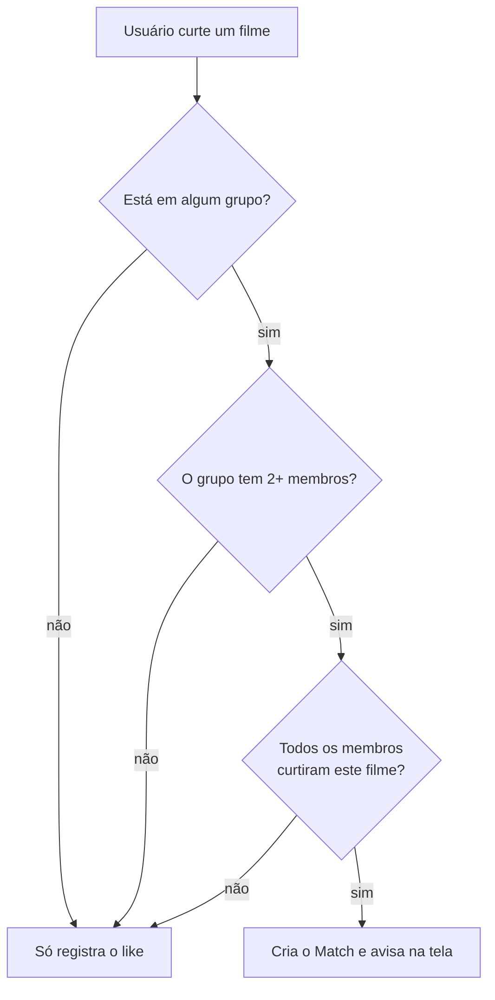

# MovieMatch

> "Tinder para filmes em grupo": cada pessoa dá like ou dislike nos filmes, e quando
> **todo mundo do grupo** curte o mesmo filme, é match — a discussão de "o que a gente
> vai ver hoje?" acaba ali.


---

## Índice

- [Sobre](#sobre)
- [Como funciona](#como-funciona)
- [Stack](#stack)
- [Começando](#começando)
- [Com Docker (recomendado)](#com-docker-recomendado)
- [Sem Docker](#sem-docker)
- [Scripts](#scripts)
- [Deploy na Vercel](#deploy-na-vercel)
- [Decisões de arquitetura](#decisões-de-arquitetura)

---

## Sobre

MovieMatch resolve a paralisia de escolha de um grupo de amigos. Em vez de discutir no
chat, cada pessoa passa pelos filmes populares da [TMDB](https://www.themoviedb.org/)
dando like ou dislike no seu próprio ritmo. O backend cruza os votos dentro de cada
grupo e registra o match assim que todos os membros curtiram o mesmo título.

**Funcionalidades**

- Cadastro e login com usuário e senha (sessão de 7 dias)
- Feed de filmes da TMDB, em português, sem repetir o que você já votou
- Toque no card para ver a **descrição completa**, ano e nota
- Grupos com código de convite para compartilhar
- Match automático no momento do scroll, com aviso na tela
- Menu do usuário com contadores e a lista de filmes curtidos (carregada de 20 em 20)
- Chat de dúvidas sobre o app, no canto inferior esquerdo, respondido por um assistente
  (Gemini 2.5 Flash). Opcional: sem `GEMINI_API_KEY` o resto do app funciona igual

## Como funciona

O scroll é **global por usuário** — você vota em um filme uma única vez, mesmo estando
em vários grupos. O match é calculado por grupo, no momento do like:



Um match, uma vez criado, **nunca é revogado**: ele registra um acordo que aconteceu
naquele momento. Entrar ou sair do grupo depois não invalida os matches anteriores.

## Stack

| Camada    | Tecnologias                                                        |
| --------- | ------------------------------------------------------------------ |
| Backend   | Node.js 20, TypeScript, Fastify 4, Prisma 5, Zod, PostgreSQL 16     |
| Frontend  | React 18, TypeScript, Vite 5, Tailwind CSS 3                        |
| Infra     | Docker Compose (Postgres + API + nginx), healthchecks, hot reload   |
| Externo   | [TMDB API](https://developer.themoviedb.org/docs) (catálogo de filmes) |

Sem bibliotecas de autenticação: as senhas usam `scrypt` e os tokens são HMAC, ambos do
`node:crypto` — nada de dependência nativa para complicar a imagem Docker.

## Começando

**Pré-requisitos**

- Uma chave da TMDB (gratuita): https://www.themoviedb.org/settings/api
- Docker Desktop **ou** Node.js 20+ e PostgreSQL 16 locais

### Com Docker (recomendado)

Sobe Postgres + backend + frontend de uma vez, já com o schema aplicado e as contas de
demonstração criadas.

```bash
cp .env.example .env     # preencha TMDB_API_KEY e AUTH_SECRET
docker compose up --build
```

| Serviço  | URL                                          |
| -------- | -------------------------------------------- |
| Frontend | http://localhost:8080                        |
| Backend  | http://localhost:3333 (health em `/health`)  |
| Postgres | `localhost:5432`                             |

**Modo desenvolvimento (hot reload)** — `tsx watch` no backend e Vite dev server no
frontend, com o código do host montado nos containers:

```bash
docker compose -f docker-compose.dev.yml up --build
```

O frontend passa a responder em http://localhost:5173. É um arquivo completo, não um
override: rode **um ou outro**, nunca os dois juntos (disputam nomes de container e
portas). Se mexer em algum `package.json`, recrie os volumes anônimos com `-V`.

/u/btwComandos úteis:

```bash
docker compose logs -f backend                   # acompanhar logs
docker compose exec backend npx prisma studio    # inspecionar o banco
docker compose down                              # parar tudo
docker compose down -v                           # parar e APAGAR o volume do Postgres
```

### Sem Docker

São **dois servidores**, em terminais separados. O de `:5173` é o que se abre no
navegador; `:3333` responde só JSON.

**1. Backend**

```bash
cd backend
npm install
cp .env.example .env     # DATABASE_URL, DIRECT_URL, TMDB_API_KEY e AUTH_SECRET
npx prisma migrate deploy  # aplica as migrations em prisma/migrations
npm run seed             # cria as contas de demonstração
npm run dev              # http://localhost:3333
```

**2. Frontend**

```bash
cd frontend
npm install
cp .env.example .env     # já aponta para o backend local
npm run dev              # http://localhost:5173
```

## Scripts

**backend**

| Comando                  | O que faz                                          |
| ------------------------ | -------------------------------------------------- |
| `npm run dev`            | API com recarga automática (`tsx watch`)           |
| `npm run build`          | Compila TypeScript para `dist/`                    |
| `npm run typecheck`      | Checa tipos sem gerar arquivos                     |
| `npm run verify:vercel`  | Roda os portões da Vercel localmente, sem deploy    |
| `npm run migrate:deploy` | Aplica as migrations pendentes no banco            |

**frontend**

| Comando           | O que faz                                  |
| ----------------- | ------------------------------------------ |
| `npm run dev`     | Vite dev server em `:5173`                 |
| `npm run build`   | Checagem de tipos + build de produção      |


## Deploy na Vercel

São **dois projetos na Vercel, a partir deste mesmo repositório** — um serve o site
estático, o outro roda a API — mais um Postgres gerenciado na Neon.

Na Vercel a API **não é um processo escutando porta** — não existe servidor de longa
duração lá. Ela empacota o entrypoint do diretório de saída como função e chama, a cada
requisição, o `export default` do `dist/index.js`. Esse handler entrega o par `req, res`
ao mesmo Fastify de sempre, montado por `construirApp()`; o `PORT` não tem efeito
nenhum.

Daí os dois arquivos de entrada:

| Arquivo               | Compila para           | Quem usa                                        |
| --------------------- | ---------------------- | ----------------------------------------------- |
| `src/index.ts`        | `dist/index.js`        | a Vercel — monta a app (`construirApp`) e exporta o handler |
| `src/bin/servidor.ts` | `dist/bin/servidor.js` | `npm run dev`, `npm start`, Docker — o `listen()` de verdade |

A montagem mora no mesmo arquivo do handler porque a Vercel **exige** que o entrypoint
importe `fastify` diretamente (veja abaixo). Rota nova entra no `construirApp`.

### 1. Banco na Neon

Crie um projeto em [neon.tech](https://neon.tech) e guarde as **duas** strings de conexão:

| Variável       | Qual string usar                                                    |
| -------------- | ------------------------------------------------------------------- |
| `DATABASE_URL` | a **com pool**, que tem `-pooler` no host — é a que a aplicação usa  |
| `DIRECT_URL`   | a **direta**, sem `-pooler` — só as migrations passam por ela        |

Migration através do pgbouncer falha; é por isso que são duas.

Aplique o schema uma vez, do seu computador:

```bash
cd backend
DATABASE_URL="<pooled>" DIRECT_URL="<direta>" npx prisma migrate deploy
```

### 2. Projeto da API

- **Root Directory**: `backend`
- **Variáveis**: `DATABASE_URL`, `DIRECT_URL`, `TMDB_API_KEY`, `AUTH_SECRET` e,
  se quiser o chat de dúvidas, `GEMINI_API_KEY`
- Anote a URL gerada (algo como `https://moviematch-api.vercel.app`)

Não mexa em Build Command nem Output Directory no painel: o `backend/vercel.json` já
define os dois — gera o Prisma Client, compila para `dist/` e aponta a saída para lá,
onde a Vercel encontra o `index.js` que responde às requisições.

Cinco detalhes que custaram deploys quebrados:

- **Nada de comentários no `vercel.json`.** O schema da Vercel rejeita qualquer chave
  desconhecida, inclusive `"//"` (`should NOT have additional property`).
- **CLI local no Build Command vai por `npm run`.** O comando roda num shell sem o
  `node_modules/.bin` no PATH, então `prisma generate` direto falha com
  `command not found` / `exited with 127`.
- **O diretório de saída precisa conter o entrypoint** (`app.js`, `index.js` ou
  `server.js`, na raiz ou em `src/`). Apontar para uma pasta sem nenhum deles dá
  `No entrypoint found in output directory`.
- **E esse entrypoint precisa ter `export default` de função ou servidor.** A Vercel
  escolhe o primeiro desses nomes que encontrar e valida o export; se ele não servir, o
  deploy passa mas a URL morre com `Invalid export found in module` +
  `The default export must be a function or server`. Foi o que acontecia quando o
  factory compilava para `dist/app.js`: ele era escolhido na frente do `index.js` e só
  exporta `construirApp`, que é nomeado. Nenhum arquivo novo deve compilar para a raiz
  do `dist` com esses três nomes.
- **E esse entrypoint precisa importar `fastify` diretamente.** Mover o factory para um
  módulo separado e deixar o `index.js` só delegando falha o build com
  `No entrypoint found which imports fastify` — a detecção olha os imports do próprio
  arquivo, não o que eles importam. É por isso que `construirApp` vive no `index.ts`.

### Testar antes de fazer deploy

Cada um dos erros acima só apareceu depois de um deploy. Não precisa ser assim — dá para
rodar os portões da Vercel na sua máquina:

```bash
cd backend && npm run verify:vercel
```

O script compila, aplica **as mesmas regras de detecção de entrypoint da Vercel** (nomes
aceitos, extensões e o regex do import de `fastify`, copiados de `@vercel/fastify`),
confere o formato do `export default` e sobe o handler para responder requisições de
verdade. Ele reprova, com a mensagem que a Vercel daria, os dois casos que já quebraram
deploy aqui.

O que ele **não** cobre é o que só existe na infra dela: empacotamento dos engines do
Prisma, variáveis do painel e o banco da Neon. Para isso, rode o build real:

```bash
# na RAIZ do repositório, não dentro de backend/
npx vercel login                              # uma vez; o token expira
npx vercel link --yes --project match-flix-web
npx vercel pull --yes --environment preview
npx vercel build                              # o build de verdade, na sua máquina
npx vercel dev --listen 3995                  # roda o output pelo launcher da Vercel
```

**Rode da raiz do repositório.** O *Root Directory* do projeto já é `backend`; rodando
de dentro de `backend/` a CLI concatena os dois e procura `backend/backend`, falhando
com um confuso `spawn npm ENOENT`.

`vercel build` executa o mesmo pipeline do deploy sem publicar nada, e `vercel dev` serve
o resultado pelo mesmo launcher que roda em produção — é ele que emite o
`Invalid export found in module`. Juntos, cobrem os dois erros que já quebraram deploy
aqui.

Confira em `.vercel/output/functions/index.func/.vc-config.json` qual entrypoint a Vercel
escolheu: `"handler": "backend/dist/index.js"` é o esperado.

### 3. Projeto do site

- **Root Directory**: `frontend`
- **Variável**: `VITE_API_URL` = a URL da API do passo 2, **sem barra no fim**
  (`https://moviematch-api.vercel.app`, não `.../`)

`VITE_API_URL` entra no bundle em **build time**. Se mudar a URL da API depois, é
preciso um Redeploy do site — editar a variável sozinha não muda nada.

### 4. Fechar o CORS

Com a URL do site em mãos, volte no projeto da API, adicione
`CORS_ORIGIN=https://seu-site.vercel.app` e faça Redeploy. Sem essa variável a API
responde a qualquer origem.

### Conferir

```bash
curl https://sua-api.vercel.app/health     # {"status":"ok"}
```

Depois abra o site, crie uma conta e curta um filme. As contas de demonstração **não**
existem em produção; para criá-las, rode `npm run seed` apontando para o banco da Neon.

> No plano Hobby a função tem limite de 10s por requisição. A rota do feed pode buscar
> várias páginas na TMDB em sequência — se ela chegar perto do limite, reduza
> `MAX_PAGINAS_POR_REQUISICAO` em `backend/src/routes/movies.ts`.

## Chat de dúvidas

O botão redondo no canto inferior esquerdo abre um chat que responde perguntas sobre o
próprio app, usando o **Gemini 2.5 Flash** — que é o modelo coberto pelo nível gratuito
do Google AI Studio. Pegue a chave em https://aistudio.google.com/apikey.

- **A chave vive só no backend.** O navegador chama `POST /chat` (rota protegida por
  login) e é o servidor que fala com o Gemini. Chave de API em variável `VITE_` seria
  chave publicada — todo `VITE_` acaba dentro do JavaScript que qualquer um baixa.
- **Nada é guardado.** A conversa vive na tela e some ao recarregar; o histórico inteiro
  sobe a cada pergunta para o assistente ter contexto. Sem tabela, sem migration.
- **O assistente sabe o que o app NÃO tem.** As instruções listam explicitamente o que
  não existe (sair de grupo, desfazer like, recuperar senha, buscar filme). Sem essa
  lista o modelo preenche a lacuna com o que seria razoável existir e manda a pessoa
  procurar um botão inexistente — o erro mais caro aqui, porque soa plausível.
- **O "pensamento" do modelo fica desligado** (`thinkingBudget: 0`). O 2.5 Flash raciocina
  antes de responder por padrão, e esse raciocínio gasta o mesmo orçamento de
  `maxOutputTokens`. Com o teto baixo daqui, ele consome tudo pensando e devolve texto
  **vazio** — falha silenciosa e difícil de achar. Uma dúvida de FAQ não precisa disso.
- **Travas de cota**: pergunta de até 1000 caracteres, 20 falas de contexto,
  `maxOutputTokens` de 400 e 20 perguntas por hora por pessoa. O contador de perguntas
  fica na memória do processo, então na Vercel, com várias instâncias, o teto real é
  maior — ele segura engano e script bobo, não um ataque. Para valer de verdade, precisa
  virar tabela no Postgres.
- **Sem a chave, o app inteiro continua funcionando**: só o chat responde 503 e mostra o
  aviso na conversa.

Para testar sem chave e sem consumir cota, defina `GEMINI_BASE_URL` apontando para um
servidor local que devolva uma resposta no formato da API — a rota funciona ponta a ponta.

## Decisões de arquitetura

- **scroll global por usuário, match por grupo.** Você curte um filme uma vez só; o
  cálculo do match compara os likes dos membros dentro de cada grupo. Evita re-swipar
  os mesmos filmes em grupos diferentes.
- **Match exige 2+ membros.** Num grupo de uma pessoa, todo like viraria match sozinho.
- **Match é registro histórico e fica congelado.** Uma vez criado, nunca é revogado —
  mudanças na composição do grupo não disparam revalidação. É intencional.
- **Autenticação sem biblioteca.** `scrypt` para senhas, HMAC do `node:crypto` para os
  tokens (7 dias). O erro de login é genérico de propósito (`"Usuário ou senha
  inválidos"`) para não revelar quem tem conta; o de cadastro é específico, porque a
  pessoa precisa saber o que corrigir.
- **Frontend sem router.** A navegação é estado local em `App.tsx`
  (`tab === 'scroll' | 'groups'`) e a sessão vive no `localStorage`. Diálogos são
  sobreposições (`fixed inset-0`), não telas: fecham no clique no fundo, no ✕ e no `Esc`.
- **Curtidos paginados.** `/me/profile` devolve só os contadores e `/me/liked` entrega
  20 por vez, porque resolver título e pôster custa uma chamada à TMDB por filme. A
  grade busca a página seguinte sozinha com `IntersectionObserver`. O cursor ordena por
  `[createdAt desc, id desc]` — o `id` é desempate obrigatório, já que likes gravados no
  mesmo instante não têm ordem total.
- **Feed com página inicial sorteada.** Começar sempre na página 1 da TMDB fazia todo
  mundo ver os mesmos 20 filmes; o backend sorteia onde entrar no catálogo e vai
  buscando páginas até juntar filmes novos o bastante.

