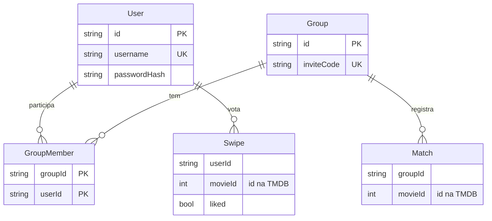

# MatchFlix

> "Tinder para filmes em grupo": cada pessoa dá like ou dislike nos filmes no seu ritmo, e
> quando **todo mundo do grupo** curte o mesmo título, é match. Acaba a discussão de "o que
> a gente vai ver hoje?".


**No ar:** [match-flix-web-cyhd-sigma.vercel.app](https://match-flix-web-cyhd-sigma.vercel.app)

---

## Índice

- [Arquitetura](#arquitetura)
- [Decisões de system design](#decisões-de-system-design)
- [Banco de dados](#banco-de-dados)
- [CI/CD](#cicd)
- [Stack](#stack)
- [Rodando localmente](#rodando-localmente)

---

## Arquitetura

```
 Navegador ──► Site (React + Vite)          estático, na Vercel
     │
     └──────► API (Fastify)                  funções serverless, na Vercel
                 ├──► PostgreSQL (Supabase)  usuários, grupos, votos, matches
                 ├──► TMDB                   catálogo de filmes
                 └──► Gemini                 assistente de dúvidas
```

Site e API são **dois projetos separados**, publicados de forma independente. O site é só
arquivos estáticos; tudo que tem estado ou segredo vive na API.

---

## Decisões de system design

### API serverless, não servidor sempre ligado

A API roda como **função** na Vercel: sobe por requisição e não existe processo de longa
duração. O mesmo código também roda como servidor comum (`npm run dev`, Docker), por meio
de dois pontos de entrada finos sobre a mesma montagem da aplicação.

**Por quê:** custo zero parado, escala sozinha e zero infraestrutura para manter — o
perfil certo para um app de uso em picos (noite de filme). **O preço:** nada de conexão
longa, o que molda a decisão seguinte.

### Match "em tempo real" por polling adaptativo, não WebSocket

O match nasce na requisição de quem vota por último. Os outros membros descobrem
perguntando por `GET /me/matches?since=`: a cada **1,5s enquanto há atividade** e a cada
**8s com o app parado**. O marco de tempo de cada pergunta é **dado pelo servidor**.

**Por quê:** em função serverless, WebSocket/SSE não sobrevive ao limite de duração nem se
propaga entre instâncias — funcionaria em desenvolvimento e morreria em produção. O
polling é barato (consulta indexada); o ritmo adaptativo deixa o aviso rápido quando o
grupo está votando junto sem multiplicar requisições de abas esquecidas; e o relógio do
servidor evita pular ou repetir avisos por relógio errado no navegador.

### Match calculado na escrita e congelado

O match é detectado **no momento do voto**, comparando os likes dos membros do grupo, e
gravado como registro. Uma vez criado, nunca é revogado — nem se alguém entra ou sai do
grupo.

**Por quê:** leitura vira consulta simples (sem recalcular interseções a cada tela), e o
histórico é estável: um match é "o grupo concordou naquele momento", não um estado que
oscila.

### Voto global por usuário, não por grupo

Cada pessoa vota uma vez em cada filme, e esse voto vale para todos os seus grupos.

**Por quê:** ninguém repete o mesmo filme em cada grupo, e entrar num grupo novo já traz
os matches possíveis com o histórico que a pessoa tem.

### O catálogo fica na TMDB, não no nosso banco

O banco guarda só o **id** do filme. Título, pôster e sinopse vêm da TMDB sob demanda, com
cache em memória por idioma.

**Por quê:** nenhum catálogo para sincronizar ou envelhecer, e o banco fica pequeno. O
cache absorve o custo de rede, que é o verdadeiro gargalo (o ranking passa de ~680 ms para
<1 ms com ele).

### Derivar em vez de denormalizar

O ranking semanal é uma agregação sobre os votos que já existem, apoiada num índice — não
existe tabela nem contador de ranking.

**Por quê:** um contador custaria uma escrita extra em todo like para acelerar uma leitura
rara, e poderia divergir da fonte. Com o índice certo a consulta cobre 200 mil votos em
~11 ms.

### Filtro de conteúdo adulto em duas camadas

A listagem já pede à TMDB só filmes até 16 anos, e cada filme ainda é conferido contra
**todas** as suas classificações de lançamento.

**Por quê:** um filme tem uma classificação por tipo de lançamento (cinema, streaming…) e
o filtro da TMDB aceita se *qualquer uma* couber — um filme 18 no cinema e 16 no streaming
passava. A segunda camada fecha esse buraco.

### Segurança com o mínimo de dependências

Senhas com `scrypt` e tokens assinados com HMAC, ambos do `node:crypto`. O `userId` sai
sempre do token, nunca do corpo da requisição. Chaves de terceiros (TMDB, Gemini) ficam
**só na API** — o navegador nunca as vê.

**Por quê:** menos dependência nativa para quebrar em build/container, e nenhuma rota
confia no cliente para dizer quem ele é.

---

## Banco de dados

**PostgreSQL**, hospedado no **Supabase**, acessado pelo **Prisma** com migrations
versionadas no repositório.



| Tabela | Papel | Restrição que carrega regra de negócio |
| --- | --- | --- |
| `User` | conta | `username` único |
| `Group` | grupo de amigos | `inviteCode` único — é o convite |
| `GroupMember` | associação N:N entre usuário e grupo | chave primária `(groupId, userId)`: ninguém entra duas vezes |
| `Swipe` | um voto | único em `(userId, movieId)`: um voto por filme |
| `Match` | filme aceito por todo o grupo | único em `(groupId, movieId)`: um match por filme |

**Por que relacional:** o domínio é feito de relações (usuários ↔ grupos ↔ votos), e o
cálculo do match é uma interseção — exatamente o que SQL faz bem.

**Por que as restrições no banco, e não só no código:** as regras "um voto por filme" e
"um match por filme" valem mesmo com requisições simultâneas ou repetidas. O banco recusa
a duplicata; o código não precisa de trava própria.

**Índices com propósito:** cada índice extra existe para uma consulta específica — um
para o ranking semanal (`liked, createdAt, movieId`, que permite ler só o índice) e outro
para o aviso de match (`groupId, createdAt`). Nenhum "por garantia".

**Conexões em ambiente serverless:** cada função abre a própria conexão, então a API fala
com o banco por um **pooler de transação**, com uma conexão por instância. As migrations
usam uma segunda URL, pelo **pooler de sessão**, porque DDL não funciona no modo
transação.

---

## CI/CD

```
branch ──push──► CI no GitHub Actions ───────► Preview na Vercel (banco de preview)
                  typecheck · build · migrations
                  num Postgres descartável · checagens da Vercel
                         │
             PR para o master — merge bloqueado até o CI passar
                         │
merge ──────────► Vercel publica produção (aplica migrations no build)
                         │
                  Verificação automática da produção
```

### Integração contínua

Todo PR roda, em paralelo, os portões do backend e do frontend: checagem de tipos, build,
**todas as migrations aplicadas num Postgres descartável** e as checagens de entrypoint
que a Vercel faria. Nada disso usa segredo de produção.

O `master` é protegido: **não aceita push direto** e o merge só libera com o CI verde.

**Por quê:** os erros que mais custaram tempo aqui — build quebrado, export errado para a
Vercel, migration inválida — são pegos em minutos, antes de chegar a qualquer ambiente.

### Entrega contínua

A Vercel está ligada ao GitHub: **o merge no `master` é o deploy**, de API e site. As
migrations pendentes rodam dentro do build; se uma falha, o build reprova e a versão
anterior continua no ar.

Depois de cada deploy de produção, um workflow roda sozinho um **teste de fumaça contra a
produção real**: API e site no ar, site apontando para a API certa, filtro de conteúdo
conferido contra a TMDB e um match completo entre duas contas de teste.

**Por quê:** deploy verde não prova que funciona — já houve deploy aprovado com a URL
morta no ar. Testar o sistema publicado, contra a fonte externa, é o que prova.

### Três ambientes, três bancos

| Ambiente | Quando existe | Banco |
| --- | --- | --- |
| Development | na máquina de quem desenvolve | Postgres local |
| Preview | a cada push em branch, com URL própria | Supabase de preview |
| Production | a cada merge no `master` | Supabase de produção |

**Por quê:** um preview pode rodar migrations e criar dados de teste à vontade sem tocar
em produção. Uma migration só chega aos dados reais depois de revisada e mergeada.

---

## Stack

| Camada | Tecnologias |
| --- | --- |
| Frontend | React 18, TypeScript, Vite, Tailwind CSS |
| Backend | Node.js, TypeScript, Fastify 4, Prisma 5, Zod |
| Dados | PostgreSQL 16 (Supabase) |
| Externo | TMDB (catálogo), Gemini (assistente) |
| Infra | Vercel (site e API), GitHub Actions (CI), Docker Compose (local) |

---

## Rodando localmente

Com Docker (sobe banco, API e site):

```bash
docker compose -f docker-compose.dev.yml up    # site em http://localhost:5173
```

Sem Docker, com um Postgres local e dois terminais:

```bash
cd backend  && cp .env.example .env && npm install && npx prisma migrate deploy && npm run seed && npm run dev
cd frontend && npm install && npm run dev      # http://localhost:5173
```

O `.env` precisa de `DATABASE_URL`, `DIRECT_URL`, `AUTH_SECRET` e `TMDB_API_KEY` (ver
`backend/.env.example`). O seed cria as contas `demo`/`demo1234` e `amigo`/`amigo1234`.
