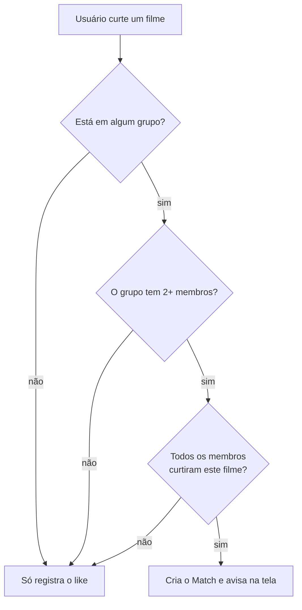
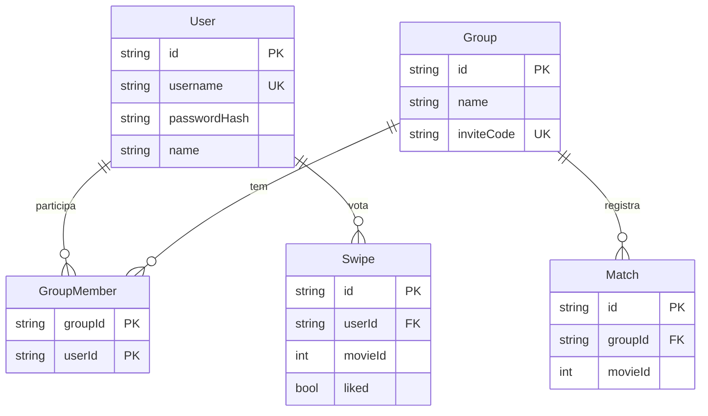

# MovieMatch

> "Tinder para filmes em grupo": cada pessoa dá like ou dislike nos filmes, e quando
> **todo mundo do grupo** curte o mesmo filme, é match — a discussão de "o que a gente
> vai ver hoje?" acaba ali.


---

## Índice

- [Sobre](#sobre)
- [Como funciona](#como-funciona)
- [Stack](#stack)
- [Começando](#começando)
  - [Com Docker (recomendado)](#com-docker-recomendado)
  - [Sem Docker](#sem-docker)
- [Variáveis de ambiente](#variáveis-de-ambiente)
- [Estrutura do projeto](#estrutura-do-projeto)
- [Scripts](#scripts)
- [API](#api)
- [Modelo de dados](#modelo-de-dados)
- [Decisões de arquitetura](#decisões-de-arquitetura)
- [Solução de problemas](#solução-de-problemas)
- [Roadmap](#roadmap)
- [Contribuindo](#contribuindo)
- [Licença](#licença)

---

## Sobre

MovieMatch resolve a paralisia de escolha de um grupo de amigos. Em vez de discutir no
chat, cada pessoa passa pelos filmes populares da [TMDB](https://www.themoviedb.org/)
dando like ou dislike no seu próprio ritmo. O backend cruza os votos dentro de cada
grupo e registra o match assim que todos os membros curtiram o mesmo título.

**Funcionalidades**

- Cadastro e login com usuário e senha (sessão de 7 dias)
- Feed de filmes da TMDB, em português, sem repetir o que você já votou
- Toque no card para ver a **descrição completa**, ano e nota
- Grupos com código de convite para compartilhar
- Match automático no momento do swipe, com aviso na tela
- Menu do usuário com contadores e a lista de filmes curtidos (carregada de 20 em 20)

## Como funciona

O swipe é **global por usuário** — você vota em um filme uma única vez, mesmo estando
em vários grupos. O match é calculado por grupo, no momento do like:



Um match, uma vez criado, **nunca é revogado**: ele registra um acordo que aconteceu
naquele momento. Entrar ou sair do grupo depois não invalida os matches anteriores.

## Stack

| Camada    | Tecnologias                                                        |
| --------- | ------------------------------------------------------------------ |
| Backend   | Node.js 20, TypeScript, Fastify 4, Prisma 5, Zod, PostgreSQL 16     |
| Frontend  | React 18, TypeScript, Vite 5, Tailwind CSS 3                        |
| Infra     | Docker Compose (Postgres + API + nginx), healthchecks, hot reload   |
| Externo   | [TMDB API](https://developer.themoviedb.org/docs) (catálogo de filmes) |

Sem bibliotecas de autenticação: as senhas usam `scrypt` e os tokens são HMAC, ambos do
`node:crypto` — nada de dependência nativa para complicar a imagem Docker.

## Começando

**Pré-requisitos**

- Uma chave da TMDB (gratuita): https://www.themoviedb.org/settings/api
- Docker Desktop **ou** Node.js 20+ e PostgreSQL 16 locais

### Com Docker (recomendado)

Sobe Postgres + backend + frontend de uma vez, já com o schema aplicado e as contas de
demonstração criadas.

```bash
cp .env.example .env     # preencha TMDB_API_KEY e AUTH_SECRET
docker compose up --build
```

| Serviço  | URL                                          |
| -------- | -------------------------------------------- |
| Frontend | http://localhost:8080                        |
| Backend  | http://localhost:3333 (health em `/health`)  |
| Postgres | `localhost:5432`                             |

**Modo desenvolvimento (hot reload)** — `tsx watch` no backend e Vite dev server no
frontend, com o código do host montado nos containers:

```bash
docker compose -f docker-compose.dev.yml up --build
```

O frontend passa a responder em http://localhost:5173. É um arquivo completo, não um
override: rode **um ou outro**, nunca os dois juntos (disputam nomes de container e
portas). Se mexer em algum `package.json`, recrie os volumes anônimos com `-V`.

Comandos úteis:

```bash
docker compose logs -f backend                   # acompanhar logs
docker compose exec backend npx prisma studio    # inspecionar o banco
docker compose down                              # parar tudo
docker compose down -v                           # parar e APAGAR o volume do Postgres
```

### Sem Docker

São **dois servidores**, em terminais separados. O de `:5173` é o que se abre no
navegador; `:3333` responde só JSON.

**1. Backend**

```bash
cd backend
npm install
cp .env.example .env     # preencha DATABASE_URL, TMDB_API_KEY e AUTH_SECRET
npx prisma db push       # aplica o schema (o projeto ainda não versiona migrations)
npm run seed             # cria as contas de demonstração
npm run dev              # http://localhost:3333
```

**2. Frontend**

```bash
cd frontend
npm install
cp .env.example .env     # já aponta para o backend local
npm run dev              # http://localhost:5173
```

**Contas de demonstração** (criadas pelo seed): `demo` / `demo1234` e
`amigo` / `amigo1234`. Entre com as duas em navegadores diferentes, coloque as duas no
mesmo grupo e curta o mesmo filme para ver o match acontecer.

## Variáveis de ambiente

**Raiz — `.env`** (lido pelo Docker Compose):

| Variável                                  | Obrigatória | Padrão        | Descrição                                              |
| ----------------------------------------- | ----------- | ------------- | ------------------------------------------------------ |
| `TMDB_API_KEY`                            | ✅          | —             | Chave da TMDB; sem ela o feed não carrega              |
| `AUTH_SECRET`                             | ✅          | —             | Segredo que assina os tokens de sessão                 |
| `POSTGRES_USER` / `_PASSWORD` / `_DB`     |             | `moviematch`  | Credenciais do container do Postgres                   |
| `DB_PORT`                                 |             | `5432`        | Porta do Postgres publicada no host                    |
| `BACKEND_PORT`                            |             | `3333`        | Porta da API publicada no host                         |
| `FRONTEND_PORT`                           |             | `8080`        | Porta do frontend na stack de produção                 |
| `FRONTEND_DEV_PORT`                       |             | `5173`        | Porta do frontend na stack de desenvolvimento          |
| `VITE_API_URL`                            |             | `localhost:$BACKEND_PORT` | URL da API **do ponto de vista do navegador** |

**`backend/.env`** (execução local): `DATABASE_URL`, `TMDB_API_KEY`, `AUTH_SECRET` e,
opcionalmente, `PORT`.

Gere um `AUTH_SECRET` com:

```bash
node -e "console.log(require('node:crypto').randomBytes(32).toString('hex'))"
```

> ⚠️ Trocar o `AUTH_SECRET` invalida **todas** as sessões existentes — todo mundo
> precisa entrar de novo.

## Estrutura do projeto

```
movie-match/
├── backend/
│   ├── prisma/
│   │   ├── schema.prisma        User, Group, GroupMember, Swipe, Match
│   │   └── seed.ts              contas de demonstração
│   └── src/
│       ├── index.ts             bootstrap do Fastify e registro das rotas
│       ├── lib/
│       │   ├── auth.ts          preHandler exigirAutenticacao → request.userId
│       │   ├── password.ts      hash e verificação com scrypt
│       │   ├── token.ts         token HMAC de 7 dias
│       │   ├── prisma.ts        cliente único do Prisma
│       │   └── tmdb.ts          chamadas à TMDB + cache em memória
│       └── routes/              auth, groups, movies, profile, swipes
├── frontend/
│   └── src/
│       ├── App.tsx              sessão + navegação por abas
│       ├── pages/               Auth, SwipeScreen, Groups
│       ├── components/          MovieCard, DetalhesFilme, MenuUsuario, Aviso
│       └── lib/                 api.ts (cliente HTTP), session.ts (localStorage)
├── docker-compose.yml           stack de produção (nginx servindo o build)
└── docker-compose.dev.yml       stack de desenvolvimento (hot reload)
```

## Scripts

**backend**

| Comando                  | O que faz                                          |
| ------------------------ | -------------------------------------------------- |
| `npm run dev`            | API com recarga automática (`tsx watch`)           |
| `npm run build`          | Compila TypeScript para `dist/`                    |
| `npm start`              | Roda o build compilado                             |
| `npm run seed`           | Cria/atualiza as contas de demonstração            |
| `npm run prisma:generate`| Regenera o Prisma Client                           |
| `npm run prisma:migrate` | Cria uma migration de desenvolvimento              |

**frontend**

| Comando           | O que faz                                  |
| ----------------- | ------------------------------------------ |
| `npm run dev`     | Vite dev server em `:5173`                 |
| `npm run build`   | Checagem de tipos + build de produção      |
| `npm run preview` | Serve o build para conferência             |

## API

Base: `http://localhost:3333`. Todas as rotas marcadas com 🔒 exigem o cabeçalho
`Authorization: Bearer <token>`; o `userId` sai **sempre** do token, nunca do corpo.

| Método | Rota                    | Auth | Descrição                                                     |
| ------ | ----------------------- | :--: | ------------------------------------------------------------- |
| POST   | `/auth/register`        |      | Cadastro → `{ token, user }`                                   |
| POST   | `/auth/login`           |      | Login → `{ token, user }`                                      |
| GET    | `/auth/me`              | 🔒   | Valida o token guardado → `{ user }`                           |
| GET    | `/movies/feed?page=`    | 🔒   | Filmes ainda não votados → `{ movies, nextPage }`               |
| POST   | `/swipes`               | 🔒   | Registra o voto → `{ swipe, newMatches }`                       |
| POST   | `/groups`               | 🔒   | Cria grupo (quem cria já entra) → `Group`                       |
| POST   | `/groups/join`          | 🔒   | Entra via código de convite → `Group`                           |
| GET    | `/me/groups`            | 🔒   | Grupos do usuário com contagens e matches                       |
| GET    | `/groups/:id/matches`   | 🔒   | Matches de um grupo (só para membros)                           |
| GET    | `/me/profile`           | 🔒   | `{ user, groupCount, likedCount }`                              |
| GET    | `/me/liked?cursor=`     | 🔒   | Curtidos em páginas de 20 → `{ movies, nextCursor }`            |
| GET    | `/health`               |      | `{ status: "ok" }`                                              |

Exemplo de uso:

```bash
# 1. login
TOKEN=$(curl -s -X POST http://localhost:3333/auth/login \
  -H 'Content-Type: application/json' \
  -d '{"username":"demo","password":"demo1234"}' | jq -r .token)

# 2. feed
curl -s http://localhost:3333/movies/feed -H "Authorization: Bearer $TOKEN" | jq '.movies[0]'

# 3. curtir um filme (o retorno traz os matches gerados)
curl -s -X POST http://localhost:3333/swipes \
  -H "Authorization: Bearer $TOKEN" -H 'Content-Type: application/json' \
  -d '{"movieId":550,"liked":true}' | jq
```

**Erros** vêm sempre como `{ "error": "mensagem" }`. Um `401` em qualquer chamada
derruba a sessão no frontend e volta para a tela de login.

## Modelo de dados



Os filmes **não** são gravados no banco: `Swipe` e `Match` guardam só o `movieId` da
TMDB, e título/pôster são resolvidos na hora de exibir (com cache em memória no
backend).

## Decisões de arquitetura

- **Swipe global por usuário, match por grupo.** Você curte um filme uma vez só; o
  cálculo do match compara os likes dos membros dentro de cada grupo. Evita re-swipar
  os mesmos filmes em grupos diferentes.
- **Match exige 2+ membros.** Num grupo de uma pessoa, todo like viraria match sozinho.
- **Match é registro histórico e fica congelado.** Uma vez criado, nunca é revogado —
  mudanças na composição do grupo não disparam revalidação. É intencional.
- **Autenticação sem biblioteca.** `scrypt` para senhas, HMAC do `node:crypto` para os
  tokens (7 dias). O erro de login é genérico de propósito (`"Usuário ou senha
  inválidos"`) para não revelar quem tem conta; o de cadastro é específico, porque a
  pessoa precisa saber o que corrigir.
- **Frontend sem router.** A navegação é estado local em `App.tsx`
  (`tab === 'swipe' | 'groups'`) e a sessão vive no `localStorage`. Diálogos são
  sobreposições (`fixed inset-0`), não telas: fecham no clique no fundo, no ✕ e no `Esc`.
- **Curtidos paginados.** `/me/profile` devolve só os contadores e `/me/liked` entrega
  20 por vez, porque resolver título e pôster custa uma chamada à TMDB por filme. A
  grade busca a página seguinte sozinha com `IntersectionObserver`. O cursor ordena por
  `[createdAt desc, id desc]` — o `id` é desempate obrigatório, já que likes gravados no
  mesmo instante não têm ordem total.
- **Feed com página inicial sorteada.** Começar sempre na página 1 da TMDB fazia todo
  mundo ver os mesmos 20 filmes; o backend sorteia onde entrar no catálogo e vai
  buscando páginas até juntar filmes novos o bastante.

## Solução de problemas

| Sintoma                                              | Causa provável e solução                                                                                     |
| ---------------------------------------------------- | ------------------------------------------------------------------------------------------------------------ |
| `npm run dev` "não faz nada" / `EADDRINUSE`          | Processo velho preso na porta. `lsof -i :3333 -P -n` (ou `:5173`) e mate antes de subir de novo.               |
| Backend recusa subir com erro de `AUTH_SECRET`       | A variável é obrigatória. Gere uma e coloque no `.env`.                                                        |
| Feed vazio ou erro ao carregar filmes                | `TMDB_API_KEY` ausente ou inválida.                                                                            |
| Frontend chama a porta errada depois de mudar a API  | `VITE_API_URL` é lida em **build time** — rebuilde o frontend.                                                 |
| Postgres não sobe no Docker                          | Um Postgres local já está na 5432. Pare um dos dois ou mude `DB_PORT`.                                          |
| `prisma db push` falha ao adicionar coluna           | Coluna obrigatória em tabela com dados: faça em duas etapas (opcional → push → backfill → obrigatória → push).  |
| Você foi deslogado do nada                           | O `AUTH_SECRET` mudou ou o token de 7 dias venceu.                                                             |

## Roadmap

- [ ] Versionar `prisma/migrations` em vez de usar `db push`
- [ ] Notificação de match em tempo real (WebSocket), não só no momento do swipe
- [ ] Filtros no feed (gênero, ano, streaming disponível)
- [ ] Tela de "onde assistir" (`/movie/{id}/watch/providers` da TMDB)
- [ ] Foto de perfil (o espaço já está reservado na UI)
- [ ] Testes automatizados (Vitest no frontend, node:test no backend)
- [ ] Deploy: frontend na Vercel, backend + Postgres no Railway/Render

## Contribuindo

O trabalho acontece em branches; `master` fica sempre estável.

```bash
git checkout -b feat/nome-da-mudanca
# ... código ...
npm run build          # nos dois projetos: checagem de tipos antes de commitar
git commit -m "feat: descrição curta no imperativo"
git push -u origin feat/nome-da-mudanca
```

Prefixos usados: `feat/` para funcionalidade, `fix/` para correção, `docs/` para
documentação, `refactor/` para reorganização sem mudança de comportamento.

Código e comentários em **português**. Comentário explica *por quê*, não *o quê*.

## Licença

Ainda não há arquivo `LICENSE` neste repositório — na prática, todos os direitos são
reservados. Se a intenção for abrir o código, adicionar um `LICENSE` com a MIT resolve.

Dados e imagens dos filmes vêm da TMDB. Este produto usa a API da TMDB, mas não é
endossado nem certificado pela TMDB.
